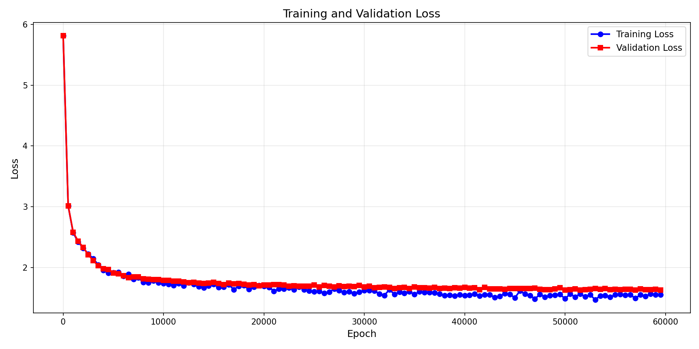

# Music Generation Transformers

This project implements a machine learning model for MIDI sequence generation using a transformer architecture.

## Model

The model is a decoder-style transformer for symbolic music generation.

```text
                  [ MIDI Events (REMI Tokens) ]
                               |
            +------------------V------------------+
            |  Token Embedding + Positional Emb.  |
            +------------------|------------------+
                               |
                           [ Dropout ]
                               |
                               V
            +-------------------------------------+
            |       TRANSFORMER BLOCK (xN)        |
            |                                     |
            |  +------> [ LayerNorm ]             |
            |  |             |                    |
            |  |      [ Multi-Head Attn ]         |
            |  |             |                    |
            |  +-----------> ( + ) <--------------+ (Residual)
            |                |                    |
            |  +------> [ LayerNorm ]             |
            |  |             |                    |
            |  |      [ Feed Forward ]            |
            |  |             |                    |
            |  +-----------> ( + ) <--------------+ (Residual)
            |                |                    |
            +----------------|--------------------+
                             V
                    [ Final LayerNorm ]
                             |
                    [ Linear Projection ]
                             |
                             V
                    [ Next Token Prediction ]
```

## Training method

Training is performed as autoregressive next-token prediction on tokenized MIDI data.

```text
      [ MIDI Dataset ] -> [ REMI Tokenizer ] -> [ Sliding Window ]
                                                      |
      +-----------------------------------------------+
      |                                               |
      V                                               V
  [ Input tokens ]                            [ Target tokens ]
  (0 to T-1)                                  (1 to T)
      |                                               |
      V                                               |
  [ Music Transformer ]                               |
      |                                               |
      V                                               |
  [ Predicted Logits ] <--- ( Cross-Entropy Loss ) ---+
                               |
                               V
                   [ AdamW Optimizer + Cosine LR ]
```


- The dataset loader constructs random context windows of fixed `block_size`.
- Each batch contains token sequences and shifted targets for the next-token objective (0 to T-1 --> 1 to T).
- The loss is the cross-entropy between model logits and the next token in the sequence.
- Optimization uses AdamW with a cosine learning rate.

## Fine-tuning with DPO

Then, we use the fine-tuning method with Direct Preference Optimization (DPO) to train the model to generate music that is more aligned with "human" preferences.

```text
           [ Prompt / Seed ]
                  |
        +---------V---------+
        |  Generator Model  |
        +---------|---------+
                  |
        ( Generate 2 samples )
         /                 \
    [ Sample A ]       [ Sample B ]
         \                 /
        +---------V---------+
        |    Judge Model    |
        +---------|---------+
                  |
        ( Winner vs Loser Pair )
                  |
        +---------V---------------------------+
        |       DPO Optimization Loop         |
        |                                     |
        | [ Active Model ] vs [ Ref Model ]   |
        |        |               |            |
        |     Logits          Logits          |
        |        \              /             |
        |          ( DPO Loss )               |
        +-------------------------------------+
```

- A generator model creates candidate sequences from the same prompt.
- A judge model scores each generated sequence. The judge model is a pre-trained MidiBert model modified to evaluate the quality of the generated sequences. 
- Pairs of winner/loser sequences are selected based on score difference.
- The active model is updated with DPO loss.

### DPO Loss Formula

The model is optimized using the following loss function:

$$L_{DPO}(\pi_\theta; \pi_{ref}) = -\mathbb{E}_{(x, y_w, y_l) \sim D} \left[ \log \sigma \left( \beta \log \frac{\pi_\theta(y_w|x)}{\pi_{ref}(y_w|x)} - \beta \log \frac{\pi_\theta(y_l|x)}{\pi_{ref}(y_l|x)} \right) \right]$$

Where:
- $\pi_\theta$ is the active model being trained.
- $\pi_{ref}$ is the frozen reference model.
- $y_w$ (winner) and $y_l$ (loser) are the preferred and non-preferred completions.
- $\beta$ is a hyperparameter that controls the strength of the penalty applied to the model to prevent it from diverging too much from the reference model.

The term $\log \frac{\pi_\theta(y|x)}{\pi_{ref}(y|x)}$ can be seen as an implicit reward for a completion $y$. The DPO objective aims to:
- Increase the reward for the winner ($y_w$): Make the active model $\pi_\theta$ more likely to generate $y_w$ than the reference model $\pi_{ref}$.
- Decrease the reward for the loser ($y_l$): Make the active model $\pi_\theta$ less likely to generate $y_l$ than the reference model $\pi_{ref}$.

The loss is minimized when the model maximizes the margin between the implicit reward of the winner and the loser, while the $\beta$ parameter ensures the model doesn't change too much compared to the original distribution.

